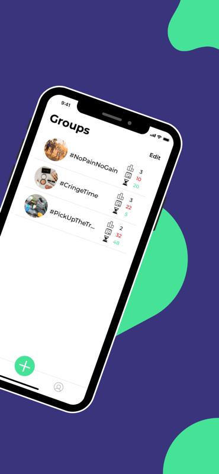
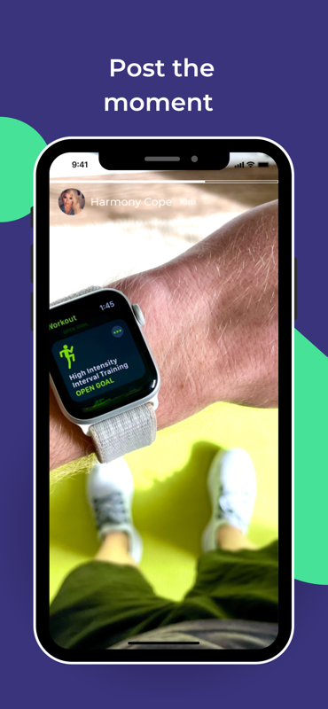
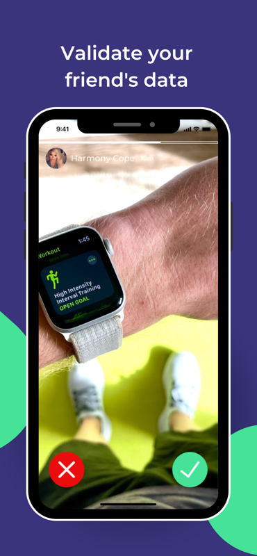

# Groupup

## Achieve, Compete, and Celebrate Together!

GroupUp is the app that turns goals into victories. Create or join closed groups, set objectives, and challenge friends to achieve greatness. Here's why GroupUp stands out:    

- Photo-Proof Validation: Prove your progress with photos, and let the group decide if it's legit.

- Community-Backed Results: Majority rules! Validated data moves you closer to victory.

- Closed, Secure Groups: Invite friends with a unique code for exclusive challenges.

- Reward-Winning Challenges: Compete for the top spot and claim rewards set by the group creator.

- Friend Challenges and Bets: Boost productivity with friendly challenges and bets.

Skip the endless chats and get straight to achieving. Download GroupUp now and turn goals into wins!

**Tech Stack:**
- Dart 3.2.6
- Flutter 3.16.9
- Firebase
    - Auth
    - Storage
    - Firestore
    - Dynamic Links
    - Remote Config
- MixPanel
- Provider
- Local Storage
- Phone Auth

## How to use the app

- Create or Join a Group:

    - Set objectives and rewards if you're creating a group.
    - Invite friends with a unique code.

- Add Inputs with Proof:

    - Contribute data with photo proof for validation.

- Review and Collaborate:

    - Evaluate and validate friends' contributions.

- Achieve Your Goals:

    - Strive for goals with group support.
    - Highest value at the end claims the reward.

